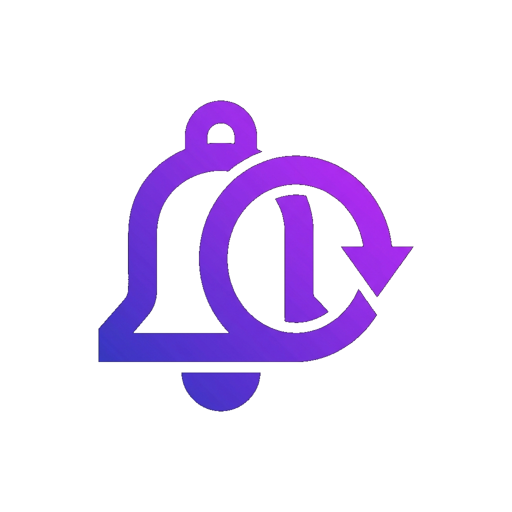

<div align="center">
  
</div>

# KeepMeUpdated

A powerful, self-hosted scheduling and notification platform. KeepMeUpdated allows you to centralize your notifications across various channels (like Email, Gotify, etc.) and schedule them down to the minute or via recurring cron and interval rules.

Built with a modular Plugin Architecture, you can extend your notification destinations without touching the core backend codebase!

## Features
- **Centralized Notification Engine**: Schedule alerts via Specific Time, Intervals, or Cron Expressions.
- **Dynamic Plugin Architecture**: Download and run third-party Notification Channels (like Gotify) and Data Sources (like OpenWeatherMap) dynamically at runtime.
- **Context Variables**: Enrich your notification payloads with dynamic data variables.
- **Modern UI**: A beautiful Vue 3 + Tailwind CSS dark-mode dashboard with custom-built sleek Modals.
- **Fully Dockerized**: Spin up the backend and frontend effortlessly with Docker Compose.

## Getting Started

### Prerequisites
- [Docker](https://docs.docker.com/get-docker/)
- [Docker Compose](https://docs.docker.com/compose/install/)

### Installation

1. **Clone the repository**
   ```bash
   git clone https://github.com/yourusername/KeepMeUpdated.git
   cd KeepMeUpdated
   ```

2. **Run with Docker Compose**
   ```bash
   docker compose up -d --build
   ```

3. **Access the application**
   Open your browser and navigate to `http://localhost`.

## Architecture
- **Backend**: Python 3.11 with FastAPI and SQLAlchemy (SQLite storage).
- **Frontend**: Vue 3, Vite, and Tailwind CSS.
- **Scheduler**: APScheduler with Croniter for complex recurrence evaluation.
- **Plugins**: A dynamic `PluginManager` uses Python's `importlib` to download and load `.py` plugin files from remote `registry.json` endpoints into the application state at runtime.

## Writing a Plugin
You can build a plugin by creating a Python file that inherits from either `BaseNotificationChannel` or `BaseDataSourcePlugin`. 
- **Channels** implement schemas for configuring the destination and dispatching the notification.
- **Data Sources** implement schemas for fetching dynamic data and returning context variables.

Place your plugin script and a `registry.json` file on a simple HTTP server to be fetched by the app.
Take as an example the [official plugin repo here](https://github.com/emkalyvas/KeepMeUpdated-plugins).

## License
MIT
